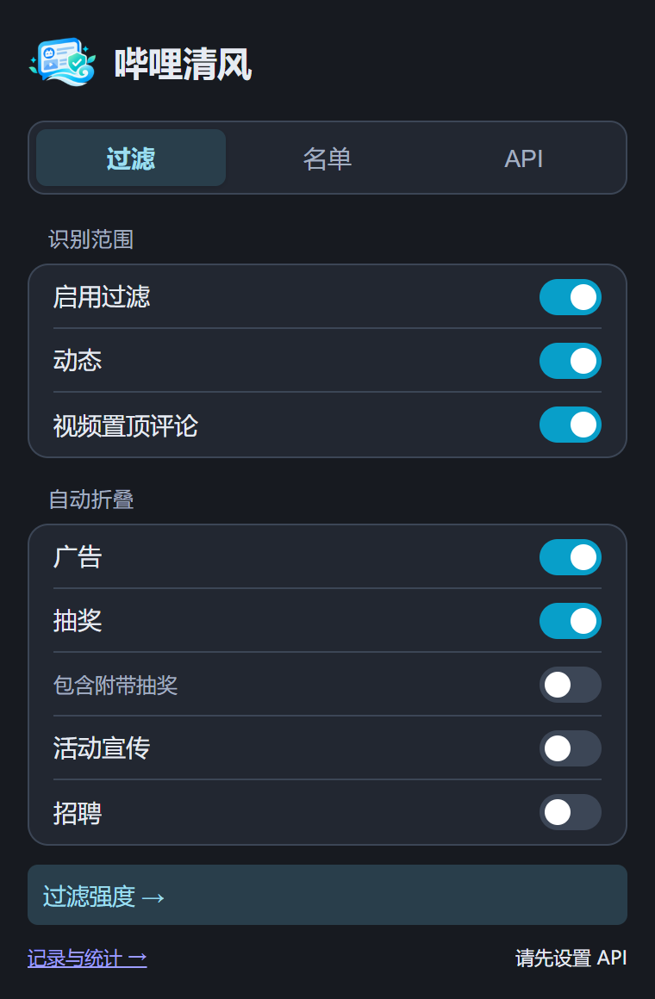
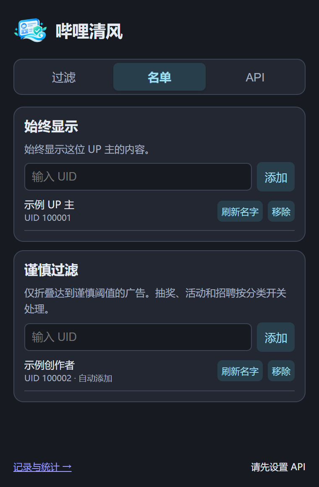
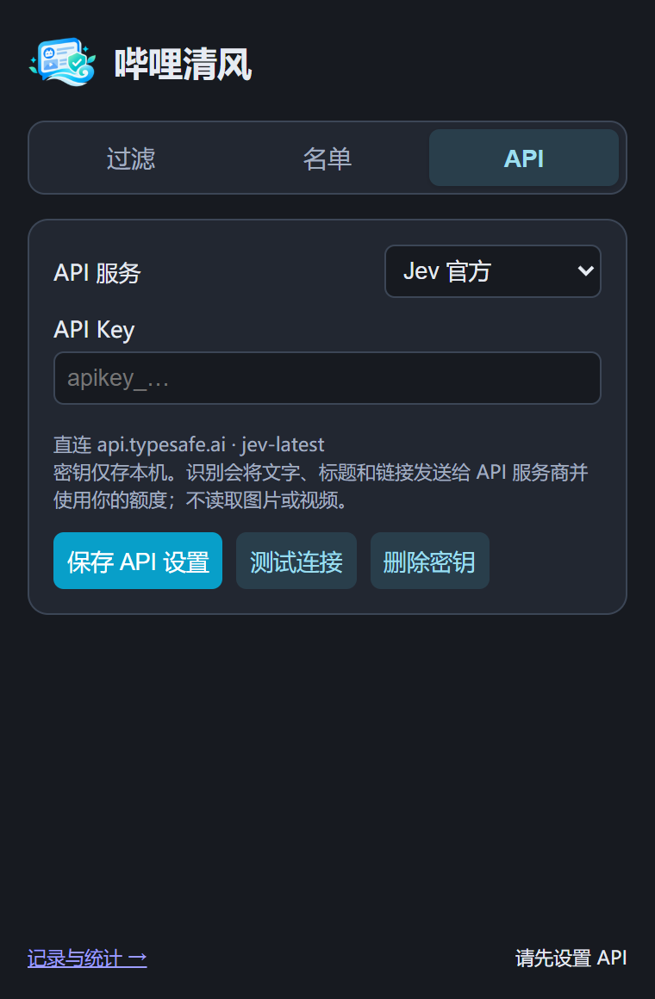

<p align="center"></p>

# 哔哩清风 · BiliBreeze

按你的偏好折叠 B 站动态和视频置顶评论中的广告、抽奖、活动宣传与招聘。支持 Chrome 和 Edge，需要配置自己的 API 密钥。

## 界面预览

| 过滤 | 名单 | API |
| --- | --- | --- |
|  |  |  |

## 安装与更新

1. 从 [发行版](https://github.com/PosvdM/bili-breeze/releases/latest) 下载 `bili-breeze-版本号.zip`，无需解压。
2. 打开 `chrome://extensions` 或 `edge://extensions`，开启「开发者模式」。
3. 将 ZIP 安装包直接拖入扩展管理页，按提示完成安装。
4. 打开扩展的「API」选项卡，保存服务地址、模型和密钥。

更新时下载新版 ZIP，拖入扩展管理页，会覆盖原扩展，设置、名单和记录保留。完成后刷新 B 站页面。

从 1.0 或 1.0.1 升级时，旧版本的扩展 ID 不固定，新版会作为另一个扩展安装，需要重新填写 API 设置和名单，然后移除旧版本。1.0.2 起扩展 ID 固定，之后的更新不再需要这样做。

## 选择要折叠的内容

在「过滤」中选择识别范围和自动折叠类别。设置自动保存，被折叠的内容可随时展开。

| 类别 | 内容 |
| --- | --- |
| 广告 | 商品推广、品牌宣传、带货等 |
| 抽奖 | 以奖品和参与方式为主要内容的抽奖 |
| 活动宣传 | 见面会、展会、演出、比赛等通知和邀约 |
| 招聘 | 员工、实习等岗位招录 |

广告只给出一个概率，不细分广告类型。官方账号介绍自家作品的预告、实机、开发进展和更新通常不算广告；优惠促销、周边带货和第三方品牌合作仍按广告判断。作者名称只作为关系线索，不作为白名单。

默认开启广告和抽奖。开启「包含附带抽奖」后，也会折叠新闻、活动等内容附带的抽奖。抽奖由关键词和模型共同判断；主次不确定时，不因抽奖折叠。不同类别可同时命中。

## 调整过滤强度

广告置信度达到阈值时折叠，默认 **70%**；谨慎过滤默认 **90%**，用于减少误判。阈值支持滑条和数字输入，谨慎阈值不会低于普通阈值。

开启自动谨慎模式后，同一 UP 主最近检测的 **10 条**不同动态中，有 **40%** 被识别为广告，就会加入谨慎过滤名单。条数和比例均可调整。加入后持续生效，广告占比下降不会移除该 UP 主。

统计按本机首次检测顺序计算，同一条动态只计一次。记录不足时继续积累；未获取 UID 时不计算。置顶评论和跳过识别的内容不计入。

## 修改识别 Prompt

「过滤强度」页底部显示判断广告、招聘和活动宣传的内置 Prompt，可以直接修改，离开输入框时自动保存，最多 4,000 字。点击「重置为内置 Prompt」或清空输入框，恢复内置 Prompt。

输出格式由扩展固定附加，不能修改；抽奖主次的判断仍使用内置规则。修改 Prompt 后，内容会重新识别，并使用你的 API 额度；恢复内置 Prompt 后可复用同一规则版本的缓存；内置规则更新后会重新识别。

从 1.0.3 升级时，已填写的补充规则会自动接在内置 Prompt 末尾，补充规则会保留。

## 管理 UP 主名单

- **始终显示（白名单）**：不折叠该 UP 主的内容，也不调用 API。
- **谨慎过滤**：使用较高的广告阈值；抽奖、活动宣传和招聘仍按分类开关处理。

可在「名单」中输入 UID 添加，也可在 UP 主动态页左侧「全部」「视频」下方点击快捷按钮。按钮显示加入状态，再点一次可移除。两个名单同时启用时，白名单优先。

名单同时显示名字和 UID，改名不影响匹配。名字获取失败时保留 UID，可稍后重试。置顶评论按视频 UP 主匹配。

自动加入的条目标注为「自动添加」。关闭自动谨慎模式只停止添加新条目；移除某个 UP 主后，不会自动加回，需要时可手动添加。

## API 与数据

支持 Jev 和 OpenAI Chat Completions 兼容接口。Jev 直连 `api.typesafe.ai`；自定义服务需填写完整 HTTPS 接口地址、模型名称和密钥，并允许浏览器访问该域名。

密钥仅保存在本机。识别会把文字、作者名称、标题和内容链接发送给所选服务商，使用你的 API 额度。扩展不分析图片或视频。

识别结果在本机缓存 30 天，最多 5,000 条。调整阈值或分类开关可复用缓存；内容、模型、接口或分类规则变化时会重新识别。

「记录与统计」保留最多 5,000 条去重记录，可查看分类、置信度和处理结果。统计只代表本机检测过的内容。模型可能误判，可通过名单和阈值调整过滤；网络较慢或快速滚动时，折叠可能延迟。

## 仓库结构

- 根目录：扩展入口、页面脚本和样式，可直接加载为未打包扩展。
- `prompts/`：分类规则（`classification.js`）、抽奖主次规则（`giveaway.js`）和两种 API 的请求组装（`request.js`）。
- `docs/`：使用说明、测试说明和截图。
- `tests/`：自动化测试；`tests/helpers/` 加载后台脚本及其依赖。
- `scripts/`：打包脚本；`icons/` 和 `branding/`：扩展图标和项目图片。

修改分类规则后递增 `prompts/classification.js` 中的规则版本，避免复用旧判定。自定义 Prompt 会保留；想使用新内置规则时，在设置中重置 Prompt。

## 开发与测试

需要 Node.js、Python 3，以及已安装的 Chrome 和 Edge。

```sh
npm install
npm test
python scripts/package.py
```

扩展包生成在 `dist/`，可直接拖入扩展管理页安装。测试使用模拟 API 响应，覆盖分类规则、名单、缓存、页面折叠和弹窗设置；不代表真实模型的分类准确率。详见 [测试记录](docs/TESTING.md)。
