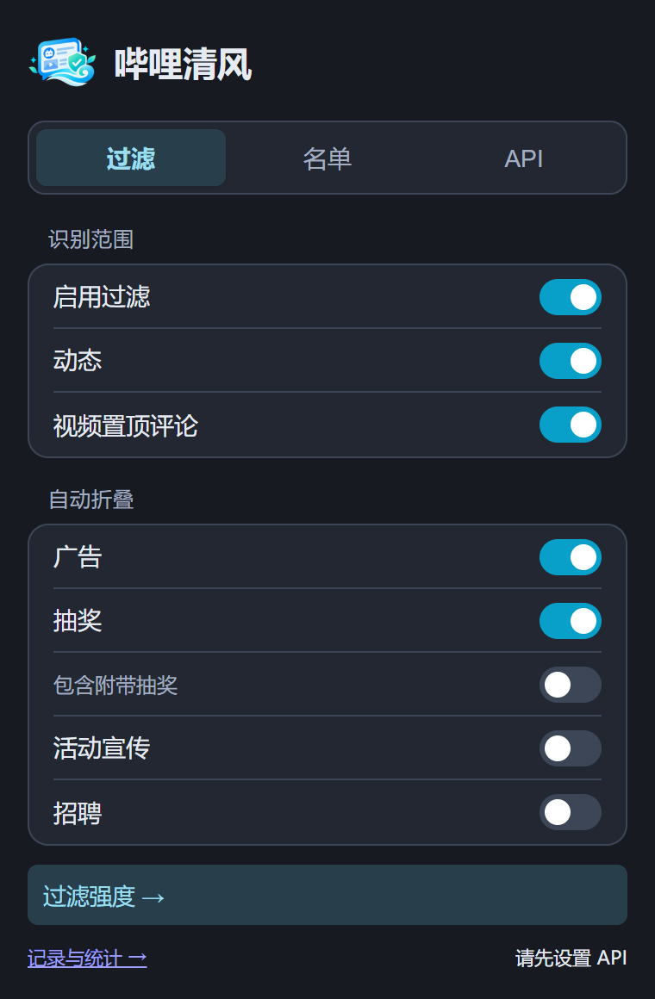
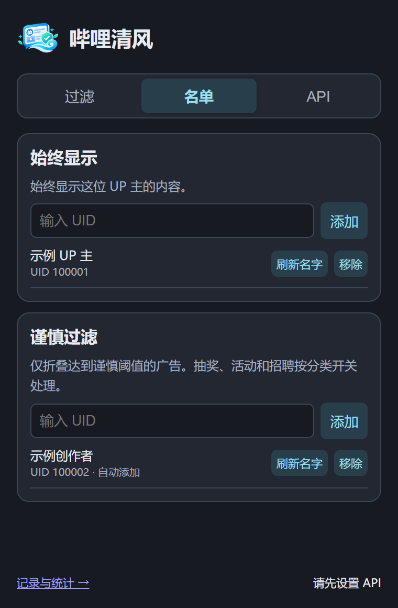
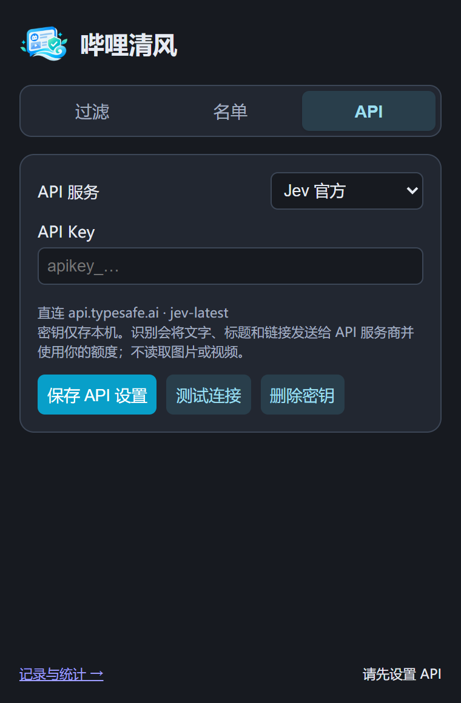

<p align="center"></p>

# 哔哩清风 · BiliBreeze

按偏好折叠 B 站动态与视频置顶评论中的广告、抽奖、活动宣传和招聘内容。支持 Chrome 与 Edge，需自行配置 API 密钥。

## 界面预览

| 过滤 | 名单 | API |
| --- | --- | --- |
|  |  |  |

## 安装与更新

1. 从 [Releases](https://github.com/PosvdM/bili-breeze/releases/latest) 下载 `bili-breeze-版本号.zip`，无需解压。
2. 打开 `chrome://extensions` 或 `edge://extensions`，开启「开发者模式」，将 ZIP 拖入页面安装。
3. 打开扩展的「API」选项卡，填写服务地址、模型和 API 密钥并保存。

更新时拖入新版 ZIP，随后刷新 B 站页面。设置、名单和记录会保留；从 **1.0 / 1.0.1** 升级需重新配置并手动移除旧版。

## 使用

- **过滤**：选择识别范围和折叠类别，默认开启广告与抽奖；已折叠内容可手动展开。
- **过滤强度**：广告置信度达到阈值时折叠，普通阈值默认 40%，谨慎阈值默认 90%。可开启自动谨慎模式，按 UP 主近期动态的广告占比自动加入谨慎名单。
- **UP 主名单**：「始终显示」不折叠且不调用 API；「谨慎过滤」提高广告阈值，其他类别仍按开关处理。可输入 UID 或在 UP 主动态页添加，白名单优先。
- **自定义 Prompt**：可修改广告、活动宣传和招聘的识别规则，也可恢复内置规则。修改后会重新识别并消耗 API 额度。

分类规则、自动谨慎模式、名单管理和缓存机制详见 [使用说明](docs/使用说明.md)。

## API 与数据

支持 Jev 与 OpenAI Chat Completions 兼容接口。Jev 直连 `api.typesafe.ai`；自定义服务需填写完整 HTTPS 接口地址，并允许浏览器访问该域名。

API 密钥仅保存在本机。识别会将文本、作者昵称、标题和内容链接发送给所选服务商，消耗你的 API 额度；不分析图片与视频。

识别结果在本地缓存 30 天，最多 5,000 条；调整阈值或分类开关可复用缓存。「记录与统计」可查看分类、置信度与处理结果。模型可能误判，网络较慢或快速滚动时折叠可能延迟。

## 开发与测试

需要 Node.js、Python 3 和 Chrome 或 Edge。可将仓库根目录作为未打包扩展加载。

```sh
npm install
npm test
python scripts/package.py
```

安装包生成于 `dist/`。测试使用模拟 API，不评估真实模型的分类准确率，详见 [测试记录](docs/TESTING.md)。

分类规则位于 `prompts/classification.js`；修改后需递增 `CLASSIFICATION_VERSION`，避免复用旧判定。已有自定义 Prompt 会保留，应用新内置规则需在设置中重置 Prompt。
